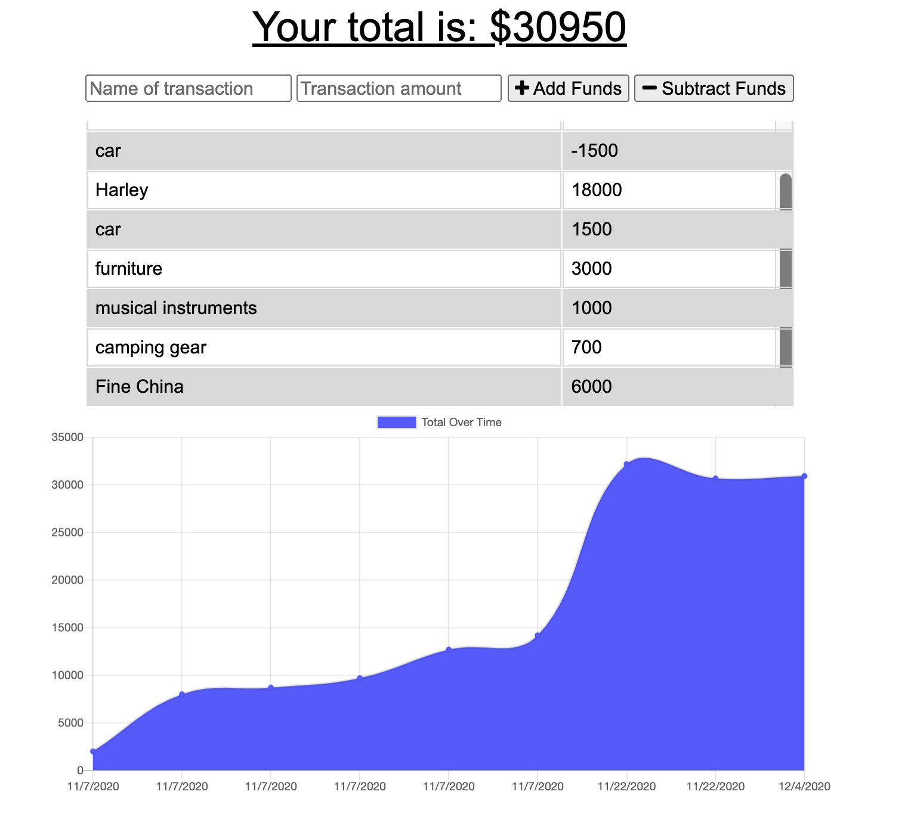

# Budget Tracker

As a finacial consciense consumer, I wanted to create an application that would allow any
user of this application to quickly and easily track their financial management actions anytime,
anywhere; without concerns of having a WiFi network to connect to.  This application does just that
it allows the user to track their finance on the go electronically with an easy manual input method
that does not require a lot of thinking.

## User Story

```
AS A conscience financial consumer

I WANT to be able to track my financail management actions while on the go

SO THAT I can better manage my financial resources

GIVEN  A budget-tracer App with user input

I am able to visual chart my assets which will allow me to stay within a specified goal
```

## Link to Budget Tracker Heroku

https://fb-budget-tracker.herokuapp.com/

## Screenshot of Budget Tracker


